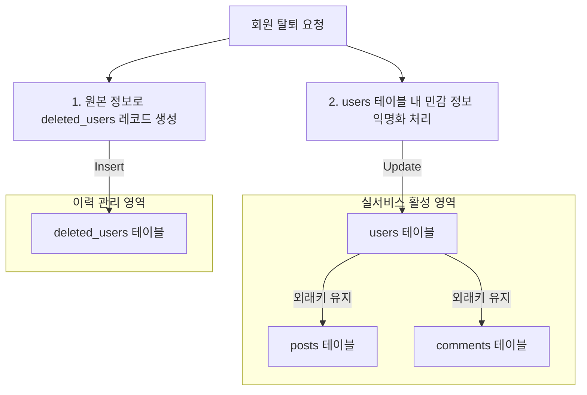

# Separating Deleted User History and Anonymizing Active Records

## Context
기존의 유저 탈퇴 처리 방식은 회원이 탈퇴하더라도 `users` 테이블 내의 원본 데이터(이메일, 닉네임 등)를 그대로 유지한 채 `deleted = true` 상태 플래그만 설정하는 방식이었습니다. 
이로 인해 다음과 같은 한계와 비즈니스/엔지니어링 상의 마찰이 발생했습니다.

1. **개인정보 보호 및 법적 규제(GDPR, PII 등) 미준수**: 탈퇴한 회원의 식별 가능한 개인정보(이메일, 닉네임 등)가 활성 데이터베이스에 그대로 남아 있어 법적 규제에 저촉될 위험이 큽니다.
2. **복잡한 표현 레이어 마스킹 로직**: 탈퇴한 회원이 작성한 게시글이나 댓글을 조회할 때 닉네임을 `"알 수 없음"`으로 노출하기 위해, QueryDSL 프로젝션(QueryDSL `Cases` 문)이나 Java DTO 레이어(삼항 연산자 분기 코드)에서 동적으로 마스킹 처리를 해야 했습니다. 이는 쿼리의 가독성을 떨어뜨리고 유지보수 비용을 증가시켰습니다.
3. **조회 성능 저하**: 매번 회원의 탈퇴 여부를 조인하거나 조건문으로 판별하여 문자열을 치환해야 하므로, 대용량 트래픽 환경에서 불필요한 CPU 및 DB 연산이 추가되었습니다.

## Guidance
실제 트래픽을 감당하는 엔터프라이즈 프로덕션 환경의 요구사항에 맞춰 **"탈퇴 회원 이력 분리 및 실 서비스 테이블 익명화(Anonymization)"** 구조를 도입합니다.



### 1. `DeletedUser` 이력 테이블 및 엔티티 구축
법적 소송 대응 및 사후 관리를 위해 탈퇴 회원 이력을 물리적으로 분리된 테이블(`deleted_users`)에 보관합니다. 이 테이블은 별도의 독자적인 라이프사이클을 가지며 오직 조회 및 법적 보관 기간 준수 목적으로만 활용됩니다.
* **저장 항목**: 원래 유저 식별값(`user_key`), 원래 이메일(`email`), 원래 닉네임(`nickname`), 탈퇴 일시(`deleted_at`) 등.

### 2. 활성 테이블(`users`) 데이터 익명화 (Physical Anonymization)
탈퇴 비즈니스 로직 수행 시 단일 트랜잭션 내에서 원래 `users` 테이블 내 민감 정보를 비식별 값으로 업데이트합니다.
* `nickname` ➡️ `"알 수 없음"`
* `email` ➡️ `"deleted_" + UUID + "@kbt.com"` (이메일 컬럼 고유 제약조건을 유지하면서 비식별화)
* `profileImage` ➡️ `null`
* `deleted` ➡️ `true`

### 3. 조회 및 표현 레이어 단순화 (Query DSL & DTO)
데이터베이스 자체에서 탈퇴 회원의 민감 정보가 이미 익명화되어 있으므로, 쿼리나 DTO 수준에서 분기문을 작성할 필요 없이 데이터를 있는 그대로 조회하여 반환합니다.

## Why This Matters

1. **개인정보 완벽 격리 (GDPR/PII 규정 준수)**
   * 활성 서비스 영역(`users` 테이블)에는 어떠한 개인식별정보(PII)도 남지 않기 때문에 개인정보 침해 사고 발생 시 위험도를 획기적으로 낮출 수 있습니다.
   * 법적 근거가 있는 기간 동안만 백업/이력용 테이블(`deleted_users`)에 보관 후 물리적으로 안전하게 영구 폐기하기 용이합니다.
2. **참조 무결성(Referential Integrity) 유지**
   * 회원을 데이터베이스에서 물리적으로 삭제(`DELETE`)하면 외래 키 제약조건으로 인해 연관된 게시글이나 댓글이 강제 삭제되거나 null 처리가 되어야 합니다.
   * 하지만 식별자(PK)를 유지한 채 정보만 익명화(Update)하므로, 연관 데이터(`posts`, `comments`)와의 외래 키 관계를 안정적으로 유지하면서 작성자가 탈퇴했음을 `"알 수 없음"`이라는 값으로 자연스럽게 표현할 수 있습니다.
3. **읽기 성능 극대화 및 코드 가독성 향상**
   * QueryDSL 조회 시 복잡한 `when().then()` 분기 쿼리가 제거되므로 쿼리가 훨씬 단순해지고 DB 파싱 성능이 향상됩니다.
   * 자바 코드 및 DTO 클래스 내의 조건부 비즈니스 로직(마스킹 분기문)이 삭제되어 표현 레이어 코드가 단순해지고 가독성이 높아집니다.

## Examples

### Before (Dynamic Masking)
```java
// QueryDSL Projection 예시 - 기존의 복잡하고 비효율적인 동적 치환 방식
public List<PostResponse> findPosts() {
    return queryFactory
        .select(Projections.constructor(PostResponse.class,
            post.id,
            post.title,
            // 매번 회원 탈퇴 여부를 체크하여 닉네임을 치환하는 dynamic masking 쿼리
            new CaseBuilder()
                .when(user.deleted.eq(true))
                .then("알 수 없음")
                .otherwise(user.nickname)
        ))
        .from(post)
        .leftJoin(post.user, user)
        .fetch();
}
```

### After (Physical Anonymization & Simplified Query)
```java
// 1. 회원 탈퇴 시점 (Service Layer)
@Transactional
public void deleteUser(Long userId) {
    User user = userRepository.findById(userId)
        .orElseThrow(() -> new UserNotFoundException());

    // A. 탈퇴 이력 테이블 저장
    DeletedUser deletedUser = DeletedUser.builder()
        .userKey(user.getUserKey())
        .email(user.getEmail())
        .nickname(user.getNickname())
        .deletedAt(LocalDateTime.now())
        .build();
    deletedUserRepository.save(deletedUser);

    // B. 활성 테이블 유저 정보 익명화 (Anonymize)
    user.anonymize(); // nickname="알 수 없음", email="deleted_"+UUID+"@kbt.com", profileImage=null, deleted=true
}

// 2. QueryDSL 단순화
public List<PostResponse> findPosts() {
    return queryFactory
        .select(Projections.constructor(PostResponse.class,
            post.id,
            post.title,
            user.nickname // DB 자체에 이미 "알 수 없음" 혹은 원래 nickname이 들어있으므로 다이렉트 바인딩
        ))
        .from(post)
        .leftJoin(post.user, user)
        .fetch();
}
```

## Prevention & Best Practices
* **유니크 제약조건(Unique Constraint) 고려**: 탈퇴 후 동일 이메일로 다시 가입하려는 경우 혹은 기존 이메일 컬럼의 유니크 제약조건 충돌을 방지하기 위해, 익명화 시 고유한 값(예: `deleted_UUID@kbt.com`)으로 치환하는 등의 메커니즘을 명확히 정의해야 합니다.
* **트랜잭션 일관성**: 탈퇴 이력 저장(`deleted_users`)과 유저 데이터 업데이트(`users`)는 반드시 **단일 트랜잭션**으로 묶여 원자적으로 처리되어야 함을 코드로 보장해야 합니다.
* **이력 보존 기간 자동 만료**: `deleted_users`에 들어간 정보는 개인정보 보호법에 따른 보존 기한(예: 3년 또는 5년)이 지나면 배치 처리를 통해 자동으로 영구 삭제되도록 라이프사이클을 추가 설계해야 합니다.
